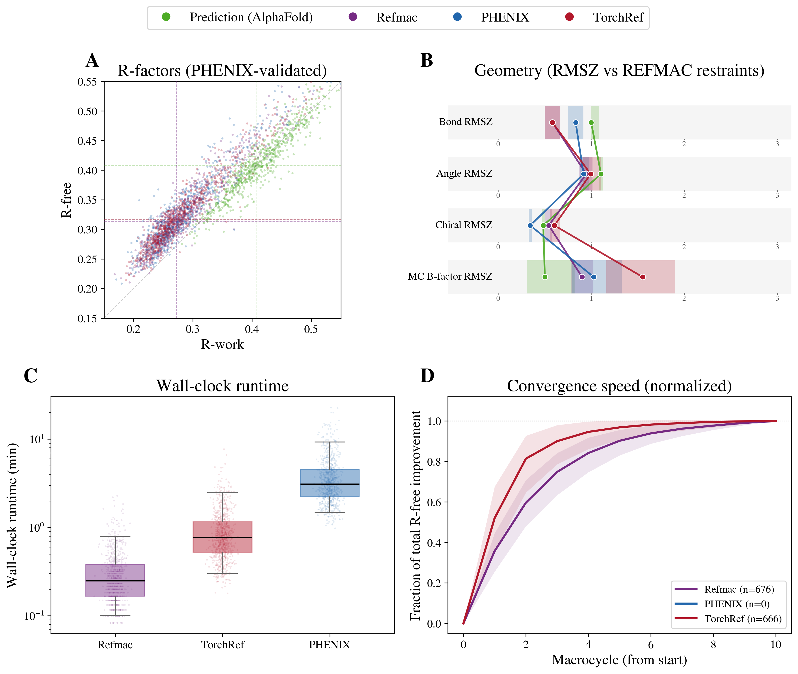

<picture>
  <source media="(prefers-color-scheme: dark)" srcset="assets/torchref-banner-dark.svg">
  
</picture>

## A PyTorch-based crystallographic refinement library

[](https://github.com/HatPdotS/TorchRef/actions/workflows/tests.yml)
[](https://www.python.org/downloads/)
[](https://pytorch.org/)
[](https://opensource.org/licenses/MIT)
[](https://torchref.readthedocs.io/)
[](https://developer.nvidia.com/cuda-zone)
[](https://developer.apple.com/metal/pytorch/)

TorchRef is a crystallographic refinement package built entirely on PyTorch. By leveraging PyTorch's automatic differentiation and GPU acceleration, TorchRef enables seamless integration with machine learning workflows and provides a flexible, extensible framework for crystallographic structure refinement.

> **Scope 
TorchRef is a mainly a library/framework to build and experiment with. It is not intended to replace mainline refinement programs for standard problems. 

## Benchmark



*Refinement of Phaser-placed AlphaFold models against experimental data, benchmarked on a conserved set of ~720 PDB structures (1.4–3.0 Å) with all engines starting from the same placed models and scored by a single common validator.*

- **(A) R-factors (PHENIX-validated).** Starting from the AlphaFold prediction (green), TorchRef (red) drives R-work/R-free down to essentially the same cluster as REFMAC (purple) and PHENIX (blue). Median R-free is 0.3167 (TorchRef) vs 0.3166 (PHENIX) and 0.3161 (REFMAC5)
- **(B) Geometry (RMSZ vs REFMAC restraints).** Bond, angle, chiral and main-chain B-factor RMS Z-scores. TorchRef produces valid, physically reasonable geometry; its restraints run slightly looser than PHENIX/REFMAC (bond RMSZ ≈ 1.3)
- **(C) Wall-clock runtime.** Median runtime per structure (4 CPU cores). TorchRef (1.65 min) sits between REFMAC (0.53 min) and PHENIX (4.63 min) — ~2.8× faster than PHENIX, ~3× slower than REFMAC.
- **(D) Convergence speed (normalized).** Fraction of the total R-free improvement achieved per macrocycle. The different programs show differing convergence behavior. 


## Key Features

- **Native PyTorch Integration**: Built on PyTorch's `nn.Module` architecture, TorchRef integrates naturally with the PyTorch ecosystem, including machine learning models, optimizers, and GPU acceleration.

- **Automatic Differentiation**: Dynamic computational graphs eliminate the need for manually implemented gradient calculations. Define new refinement targets directly—PyTorch handles the derivatives automatically.

- **Modular Architecture**: Following PyTorch's module pattern, components are easily composable and extensible. Add custom targets, restraints, or optimizers without modifying core code.

- **GPU Acceleration**: Leverage CUDA for structure factor calculations, scaling, and optimization—achieving significant speedups for large structures. Apple Silicon GPUs are also supported through PyTorch's MPS backend (unsupported ops fall back to CPU automatically via `PYTORCH_ENABLE_MPS_FALLBACK=1`, which TorchRef sets on import).

- **FFT-based Structure Factors**: Efficient structure factor calculation using Fast Fourier Transform (FFT) methods, enabling rapid F_calc computation even for large unit cells.

## Getting Started

| Notebook | Description |
|----------|-------------|
| [](https://colab.research.google.com/github/HatPdotS/TorchRef/blob/main/example_notebooks/quickstart.ipynb) | Quickstart — MTZ + PDB to refined structure, refined MTZ and CCP4 map; selection- and parameter-type-based refinement |
| [](https://colab.research.google.com/github/HatPdotS/TorchRef/blob/main/example_notebooks/structure_factors.ipynb) | Structure factors — one-liner, `FFT` class, and manual voxel pipeline; standalone scaling; autograd |
| [](https://colab.research.google.com/github/HatPdotS/TorchRef/blob/main/example_notebooks/targets_and_weighting.ipynb) | Targets and weighting — standard targets, target-offset weighting, X-ray mode comparison, custom targets, driving an optimizer from a `LossState` |

### Installation

```bash

pip install torchref

```

#### Local installation for development

#### clone the repository
git clone https://github.com/HatPdotS/TorchRef.git
cd torchref

#### Install with pip
pip install -e .

#### Or install with development dependencies
pip install -e ".[dev]"

### Dependencies

- Python ≥ 3.10
- PyTorch ≥ 2.4
- NumPy ≥ 2.0
- Gemmi ≥ 0.5
- reciprocalspaceship ≥ 0.9.18
- SciPy ≥ 1.10

### Testing

```bash
# Run all tests
pytest tests/

# Run with coverage
pytest tests/ --cov=torchref

# Run specific test categories
pytest tests/unit/           # Fast unit tests
pytest tests/integration/    # Integration tests
pytest tests/functional/     # Full workflow tests
```

### Contributing

Contributions are welcome! Please follow these guidelines:

1. Follow the [NumPy docstring style](https://numpydoc.readthedocs.io/en/latest/format.html)
2. Add tests for new functionality
3. Ensure all tests pass before submitting

### License

This project is licensed under the MIT License - see the [LICENSE](LICENSE) file for details.


